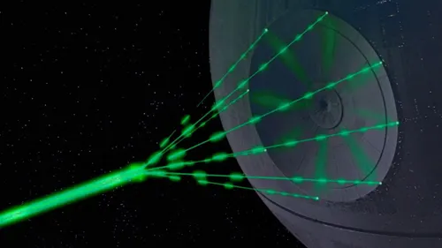
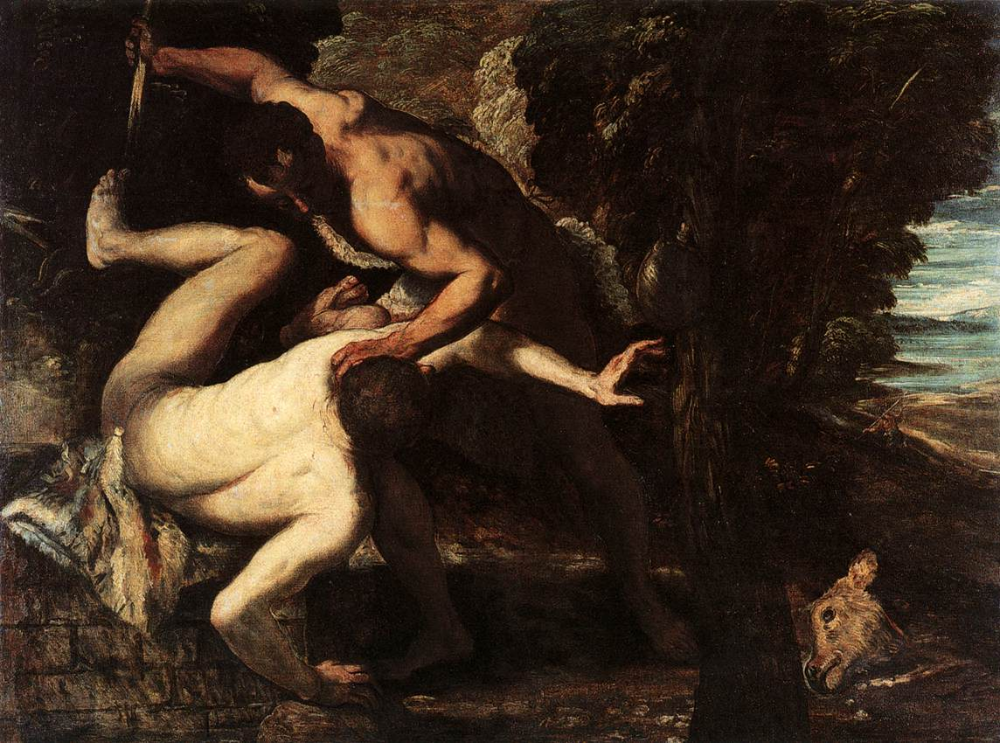

# The Math of the Mob
## Why Scapegoating Is Computationally Efficient, Morally Arbitrary, and Foundational to Human Culture

Imagine a simple social network: six people with positive and negative relationships—friendships and enmities. In graph theory, a triangle of three people is "balanced" when it has an even number of negative edges: either all friends (+++) or two allies against a common enemy (+--). Unbalanced triangles like ++- (two friends both connected to a mutual enemy) or --- (three mutual enemies) create social tension.

Now imagine you want to resolve all the tensions in this network—to reach a state where every triangle is balanced. This is a well-studied problem in graph theory called structural balance (we explored this in depth in our [previous post on balance theory](https://politicalatheism.substack.com/p/why-your-politics-decides-what-you-drink)). For small networks, it should be trivial.

It's not.

I tried to solve this computationally for a six-person network starting at maximum tension. The standard approach—a greedy algorithm that makes the most beneficial move at each step (flipping an edge that reduces the number of unbalanced triangles)—failed immediately. At the initial state there were no beneficial moves. The only path to balance required making things *worse* first, climbing uphill in tension before descending to stability.

This is a classic optimization problem: local minima. The solution is called hill-climbing, where the algorithm makes random moves hoping to stumble onto a descending path. The single successful run above masks the real problem: we needed hundreds of attempts to find this path. The success rate was around 1 in 3 for this tiny 6-person network.

As graphs scale up, the computational cost explodes. For a 20-node graph, we'd need thousands of attempts, each requiring the algorithm to wander randomly through hundres of worse states.

And here's what makes this theoretically unsatisfying: **humans don't resolve social conflict this way.** We don't calculate the energy of our social networks and randomly flip friendships until we find global equilibrium. We are no more network optimizers than we are homo economicus.

So what mechanism do humans use to resolve social conflict? I went back to Girard to find out.

# The Scapegoat Effect

Girard's cultural theory can be broken down into four steps:

1. Mimetic desire: Humans imitate each other's desires, leading to rivalry.
2. Mimetic crisis: Undifferentiated rivalries create social instability, what we might call the peak of the hill-climbing algorithm.
3. Scapegoat mechanism: Groups resolve crisis by uniting against a single victim. (what we are covering now!)
4. Return to step 1.

Girard explains the key mechanism:

> Mimetic attraction is bound to increase with the number of those who converge on one and the same antagonist. Sooner or later a snowball effect must occur... Whereas mimetic appropriation is inevitably divisive, mimetic antagonism is ultimately unitive since it provides the antagonists with an object they can really share. (THE GIRARD READER, p. 11-12)

In other words: rivalry over objects divides us (we both want the same thing), but shared hatred of a person unites us (we can all hate them together). Scapegoating transforms chaotic conflict into coordinated violence.

So, thought I, how might we represent this mechanism graphically? How does scapegoating actually spread through a network? And how does it create social harmony in the aftermath?

Girard implicitly gives all the steps necessary to make this into an algorithm, but let's make it more explicit. The scapegoating process unfolds in four steps:

First, the initial accusation. One node accuses another—of what, it does not matter. The sign between them flips to negative if it wasn't already.

Second, the accusation spreads through friendship networks. The accuser tells all their friends about the scapegoat. This happens via friendly neighbors only using something called breadth-first search.

Third, each person who hears the accusation must respond based on their local relationships. If you're friends with both the accuser and the accused, you face the social bind of a ++- triangle. The tension forces you to pick a side. Under mimetic pressure, you flip against the scapegoat and join the mob. If you're friends with the accuser but don't know the scapegoat yet, you believe your friend and form a negative opinion—creating a new - edge. If you already hate the scapegoat, you befriend others who also hate them, forming alliances. The --- triangle resolves into +-- (enemy of my enemy is my friend).

Fourth, convergence. As this hatred spreads through the network, eventually the scapegoat becomes infamous—everyone hates them. But the key to it all is: once everyone shares a common enemy, any remaining conflicts within the community resolve automatically. If you and I both hate the scapegoat, we can't be enemies lest we form a --- so we must be friends united against the scapegoat, +--. In this way, the community unifies through shared hatred.

For those familiar with graph theory: this isn't traditional balance optimization. Standard approaches minimize edge flips and assume static graphs—treating balance as a measurement problem on fixed data. We do neither. Our algorithm creates new edges when nodes hear accusations about strangers, doesn't seek minimal solutions, and models information spread rather than optimization. This isn't a flaw—it reflects how scapegoating actually works in social networks. People don't minimize anything. They hear from friends, pick sides under pressure, and form opinions about people they've never met.

The process is remarkably simple. Time complexity is O(|V| + |E|) for typical social networks, converging in two passes. Compare this to iterative optimization methods that can require millions of attempts to escape local minima on the same graph. But the real point isn't speed—it's that the mechanism doesn't require computation at all. The rules are simple enough that you could trace them by hand on paper. That simplicity suggests we might be closer to how these dynamics actually work. 

Now, in basically any complex graph this approach converges; however, there are some isolated instances where it fails to achieve the unity of all-against-one. The instances where it fails illuminates why it is that certain people make "good" scapegoats while others do not.

# When Scapegoating Succeeds—And When It Fails

Take the simplest case of a chain of three nodes (A - B - C). If the initial accuser is A and the scapegoat is B, then the accusation will never reach C.

Similarly, if you have two communities connected through a couple of bridge nodes, if you accuse one of the bridge nodes, the accusation will never reach the other community.

But the most revealing comparison is between hubs and peripheral nodes.  Consider a hub-and-spoke network where one central node connects to five peripheral nodes who don't know each other.

If the hub is the scapegoat and a peripheral node is the accuser, the accusation fails catastrophically. The peripheral node, having just severed their only connection by accusing the hub, cannot tell anyone else. They become isolated, not the hub.

But if a peripheral node is the scapegoat and the hub is the accuser, the accusation spreads instantly to everyone. The hub tells all five peripheral nodes, and the scapegoat becomes completely isolated in a graph that looks like the beams of the death star.

So, clearly not everyone makes a "good" scapegoat. That's something Girard discussed as well...

# Validating Girard

Girard observed that scapegoats are typically on the periphery of society. Victims often bear what he called "preferential signs of victimization"—physical deformities, foreign origins, unusual traits. In medieval illustrations, witches are depicted hunched and limping. These signs don't cause guilt, but they make someone easier to single out.

> Therefore, it is a combination of arbitrariness and necessity. Very often, but not necessarily, because even if there isn't a preferential sign of victimization, the scapegoat will be chosen anyway. At that crucial moment something will often be interpreted as a sign. Anything. The scapegoat mechanism functions like false science, like a great discovery that is made. (EVOLUTION and CONVERSION, p. 69)

Now we can add the graph theory reason why scapegoats are often peripheral: if they have defenders who function as bridge nodes, those defenders can block the spread of the accusation throughout the community. If the accusation doesn't spread through the entire network, the accused fails to be a scapegoat at all. They remain controversial, not unanimously hated.

Peripheral nodes have no such defenders. Removing them leaves the network intact. Social gatekeepers, by contrast, are structurally protected—attempting to scapegoat them fragments the community into isolated clusters.

We might assume that a node that is "peripheral" would be someone of low standing in the community—poor, foreign, other—but Girard points out the opposite may also be true:

> In normal times the rich and powerful enjoy all sorts of protection... But in periods of crisis, a mere glance at world history will reveal that the odds of a violent death at the hands of a frenzied crowd are statistically greater for the privileged than for any other category. Crowds commonly turn on those who originally held exceptional power over them. (Girard Reader, p. 112)

We can explain this computationally. A king or celebrity is maximally famous—everyone in the network knows them, though they're not necessarily the hub through which all social connections pass. When such a person is accused, no new edges need to be created during contagion. Only existing positive relationships flip to negative. They quickly transition from fame to infamy.

Whether you're scapegoating the most peripheral beggar or the most famous king, the computational work is identical. Both require the same number of edge changes. In the peripheral case, many new edges are created as people hear about the scapegoat for the first time. In the famous case, existing edges flip from positive to negative since everyone already knew them.

Same effort, same outcome—complete isolation. But opposite positions in the social hierarchy. Both extremes share a crucial property: their removal doesn't fragment the network. Those who are in communities that are loyal unto themselves—families, ethnic groups, congregations—can never be fully scapegoated. It is the weak, the powerful, and more generally the independent and isolated that are the most vulnerable to being victimized.

The most unsettling aspect of the mechanism is that the content of the accusation itself is irrelevant. The graph has no concept of guilt or innocence. Perhaps one accusation may spread better than another in one culture or another, but whatever the content the outcome is the same.

Witch! heretic! terrorist! bigot! socialist!—the accusation can be anything. The scapegoat can be an Austrian queen accused of undermining the nation, a minority group that's poisoning society, a beggar in Athens turned pharmakos, a black boy who whistles at a white woman, an incestuous and patricidal king, a prophet stirring up trouble in Judea—what matters not is the truth of the accusation or the guilt of the accused, but whether the network topology permits their isolation.

# The Dark Foundation of Culture

Perhaps you were wondering earlier why you should care about graph algorithms and balance theory. As we've begun to uncover, these nodes and edges are not just mathematical abstraction—they allow us to unmask the darkest social mechanisms we use to organize ourselves.

Girard argued that the scapegoat mechanism isn't just a social phenomenon but its the origin, the ἀρχή, of human culture. In his reading of Genesis, the first murder—Cain killing Abel—was the first scapegoating, and all of human society descends from that primordial violence. The scapegoat mechanism is the generative force behind religion, law, and social order. Through the violence of the scapegoating and the peace that follows, taboos are created, norms established, institutions formed, and societies organized.[^2]

The scapegoat mechanism "solves" social conflict not by resolving underlying tensions but by focusing them all on a single target. It achieves perfect structural balance (E=0) not through negotiation or justice or rationality but through coordinated exclusion. 

And that efficiency—single-pass, linear time, guaranteed convergence—reveals something about human social cognition. We are not global optimizers carefully weighing all relationships. We are local reactors, responding to immediate social pressure from our friends, cascading information through networks, making snap judgments about who to trust and who to hate. And because such a reaction is necessary for survival (you don't want to get lumped in with the scapegoat), we are likely genetically wired to participate in such a rite.

The mechanism persists because it works. In online pile-ons, political witch hunts, and social cancellations, we see the same pattern: an accusation spreads through networks, people pick sides under social pressure, communities unify against a target. The computational efficiency we've demonstrated explains why these dynamics are so robust and so difficult to escape. This algorithm, although simple, offers a first step toward understanding this most foundational of social mechanics.

Girard believed that revealing the scapegoat mechanism was the first step toward transcending it. For millennia, cultures enacted this mechanism unconsciously, believing in the guilt of their victims. By laying this pattern bare—whether through anthropological analysis or computational modeling—we can begin to recognize when we're being swept into the mob.

We are all marked as Cain was; we all descend from that founding murder. But perhaps through computationally-enabled understanding of ourselves and our social dynamics, we may find salvation.

[^1]: A few caveats here: although it should be single pass theoretically, in practice we use two phases—one for the spread of the accusation and a second to clean up any --- triangles involving the scapegoat to make them +--. After optimization, the algorithm now runs remarkably fast: a 5,000-node network completes in under 4 seconds—what would have taken nearly 4 hours with naive implementation. The key insight was that only the scapegoat's enemies can form --- triangles with them, reducing the cleanup phase from O(V²) to O(k²) where k is the scapegoat's degree (~20 in sparse social networks). This 850x speedup at 1,000 nodes demonstrates that the mechanism's simplicity isn't just conceptual, it's computationally efficient in practice. See [OPTIMIZATION_RESULTS.md](../mimetic-contagion/docs/OPTIMIZATION_RESULTS.md) for more details.

[^2]: See *The Girard Reader*, pg. 147-151. 

> R.G.: First let us take the story of Cain in Chapter 4 of Genesis. . . . The myth of Cain is presented in classic fashion. One of the two brothers kills the other, and the Cainite community is founded.  
> People have often asked why God, although he condemns the murder, responds to the appeal of the murderer. Cain says: "Whoever comes across me will kill me!" And God responds: "If anyone kills Cain, vengeance shall be taken on him sevenfold." God himself intervenes, and in response to the founding murder he enunciates the law against murder. This intervention makes it clear, in my view, that the decisive murder, here as elsewhere, has a founding character. And to talk in terms of "founding" is also to talk in terms of "differentiating," which is why we have, immediately afterward, these words: "And the Lord put a mark on Cain, to prevent anyone finding him from striking him down." I see in this the establishment of a differential system, which serves, as always, to discourage mimetic rivalry and generalized conflict.  
> ...  
> With reference to the violence that both founds and differentiates, the story of Cain has, in addition to its unquestionable significance as myth, a much greater power of revelation than that of non-Judaic myths. Certainly there must be, behind the biblical account, myths in conformity with the universal norms of mythology; so the initiative of the Jewish authors and their critical reappraisal must undoubtedly be credited with the affirmation that the victim is innocent and that the culture founded on murder retains a thoroughly murderous character that in the end becomes self-destructive, once the ordering and sacrificial benefits of the original violence have dissipated.

See also *I See Satan Fall Like Lightning*, pg. 86.

> The Gospel of John has a saying of Jesus that is equivalent to Luke's, and it confirms the interpretation I have just given. It is a statement found in the middle of Jesus’ great speech about the devil (John 8), and I have already commented on it in chapter 3. It too is a definition of that which Mircea Eliade calls the “creative” murder: “He [the devil] was a murderer from the beginning.”… The word here translated “beginning” is arche in the Greek, which means “origin,” “first appearance,” or “beginning.” The reference cannot be to the creation ex nihilo, for that is completely God's work and cannot be associated with violence. The “origin” or “beginning” must have to do with the first human culture. The word arche thus has the same sense as katabole tou kosmou in the Gospels of Luke and Matthew, the foundation of the first culture.

[^3]: See *The Scapegoat*, pg. 110-111.

> The sentence that defines the unconscious persecutor lies at the very heart of the Passion story in the Gospel of Luke: “Father, forgive them; they do not know what they are doing (Luke 23:34). Christians insist here on the goodness of Jesus. This would be fine were it not that their insistence eclipses the sentence’s real meaning, which is scarcely ever recognized. The commentary on this sentence implies that the desire to forgive unpardonable executors forces Jesus to invent a somewhat trifling excuse for them that hardly conforms to the reality of the Passion.

> Commentators who refuse to believe what this sentence says can only feel faint admiration for it, and their devotion imbues the text with the taint of their own hypocrisy. The most terrible distortion of the Gospels is our ability to project our own hypocrisy on them. In reality the Gospels never seek lame excuses; they never speak for the sake of speaking; sentimental verbiage has no place in them.

> If we are to restore to this sentence its true savor we must recognize its almost technical role in the revelation of the scapegoat mechanism. It says something precise about the men gathered together by their scapegoat. They do not know what they are doing. That is why they must be pardoned. This is not dictated by a persecution complex or by the desire to remove from our sight the horror of real violence. In this passage we are given the first definition of the unconscious in human history, that from which all the others originate and develop in weaker form: the Freudians will push the dimension of persecution into the background and the Jungians will eliminate it altogether.